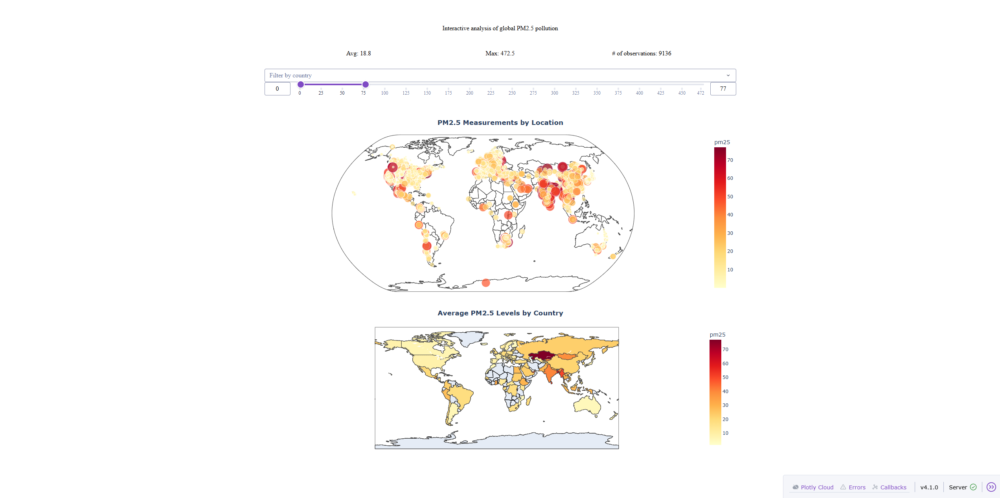
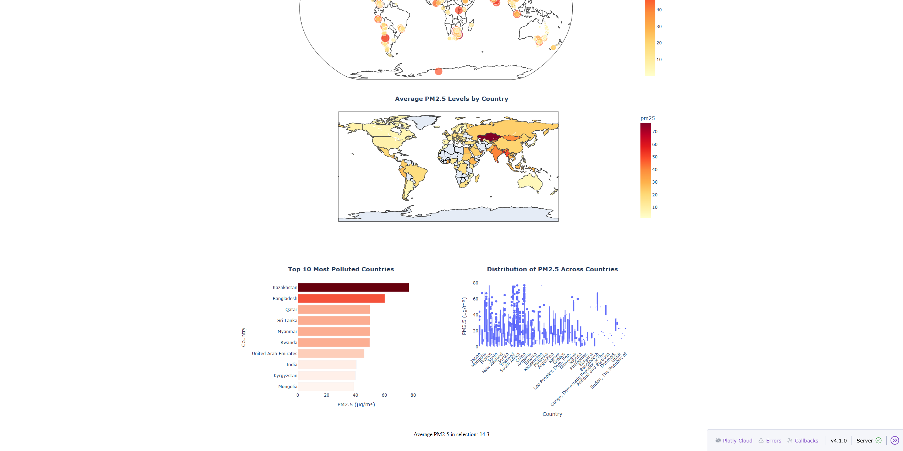

# Global Air Pollution Dashboard

An interactive geo-spatial dashboard for analyzing global air pollution (PM2.5) using Python, Dash, and Plotly.

---

## Project Overview

Air pollution is a major global health concern, with significant variations across regions and countries.  
This project explores global PM2.5 pollution patterns through geo-spatial data analysis and interactive visualization.

The dashboard enables users to:
- Explore pollution at specific geographic locations
- Compare pollution levels across countries
- Filter and analyze data dynamically
- Identify global pollution hotspots

---

## Objectives

- Analyze global PM2.5 pollution data  
- Identify spatial patterns and hotspots  
- Compare pollution levels across countries  
- Build an interactive dashboard for exploration  

---

## Features

### Geo-spatial Visualizations
- **Scatter Map**  
  Displays point-level PM2.5 measurements across the globe  

- **Choropleth Map**  
  Shows average PM2.5 levels per country  

---

### Analytical Visualizations
- **Bar Chart**  
  Highlights the top 10 most polluted countries  

- **Boxplot**  
  Shows the distribution and variability of PM2.5 across countries  

---

### Interactivity
- Country filter (dropdown)  
- PM2.5 range filter (slider)  
- Map click interaction (cross-filtering)  
- Dynamic chart titles based on selection  

---

## Key Insights

- Air pollution is **unevenly distributed globally**  
- Certain regions exhibit **high pollution concentrations (hotspots)**  
- PM2.5 values follow a **skewed distribution with extreme outliers**  
- There is significant **variation within countries**  

---

## Tech Stack

- **Python**
- **Dash** (interactive dashboard framework)
- **Plotly** (visualizations)
- **Pandas** (data processing)

---

## Project Structure
air-pollution-dashboard/  
│  
├── data/  
├── src/  
│ └── app.py  
├── notebooks/  
├── outputs/  
├── requirements.txt  
└── README.md  

---

## Installation & Setup

### 1. Clone the repository

```bash
git clone https://github.com/MnOuSs/air-pollution-dashboard.git
cd air-pollution-dashboard
```

### 2. Install dependencies

```bash
pip install -r requirements.txt
```

### 3. Run the dashboard

```bash
python src/app.py
```
Then open in your browser

http://127.0.0.1:8050/

---

## Screenshots




---

## Author

**Oussama Manai**